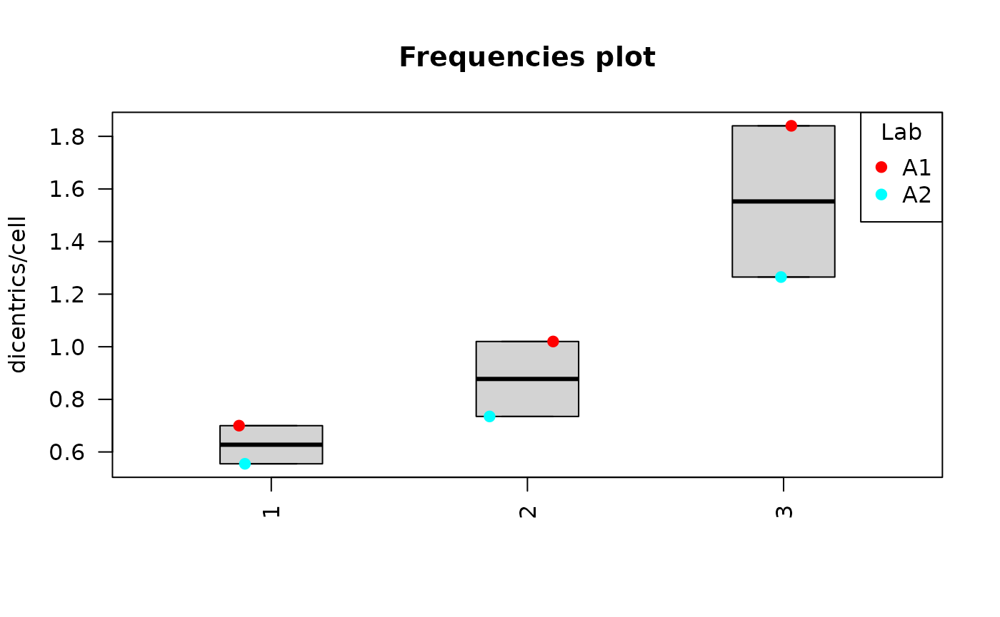
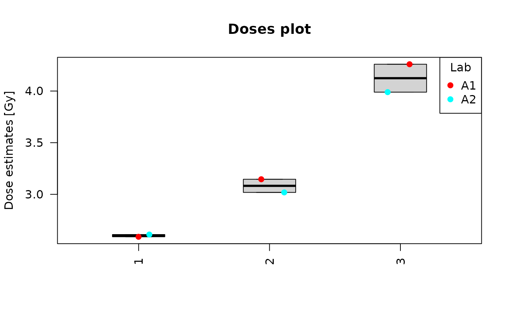
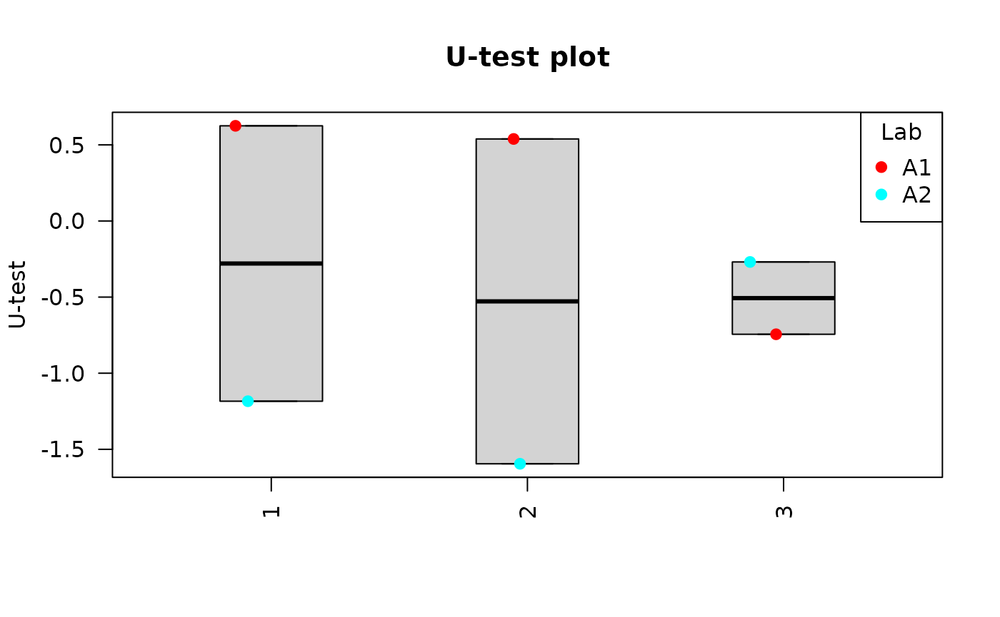
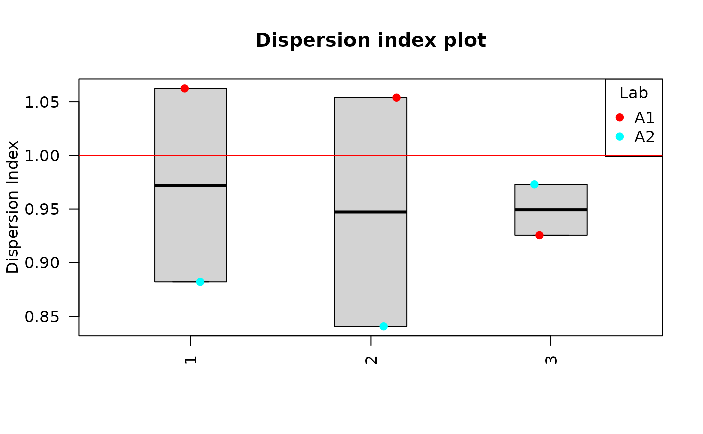
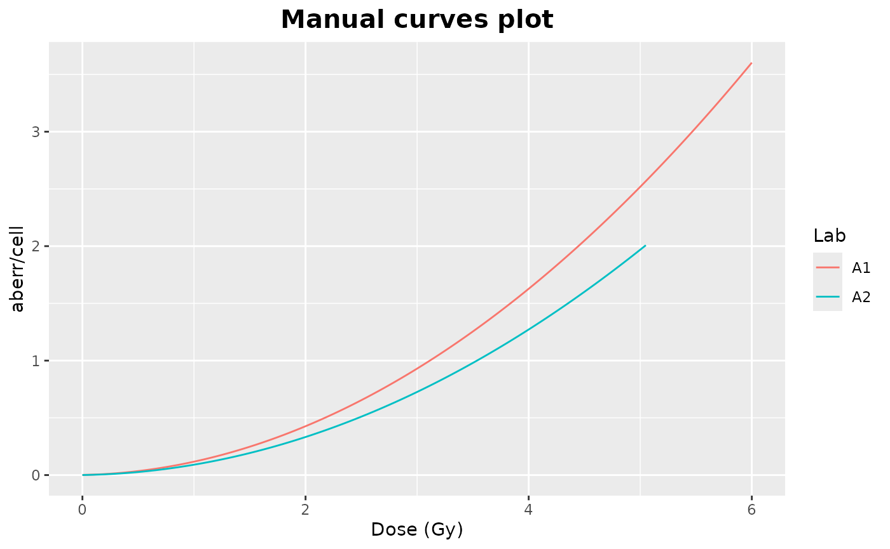
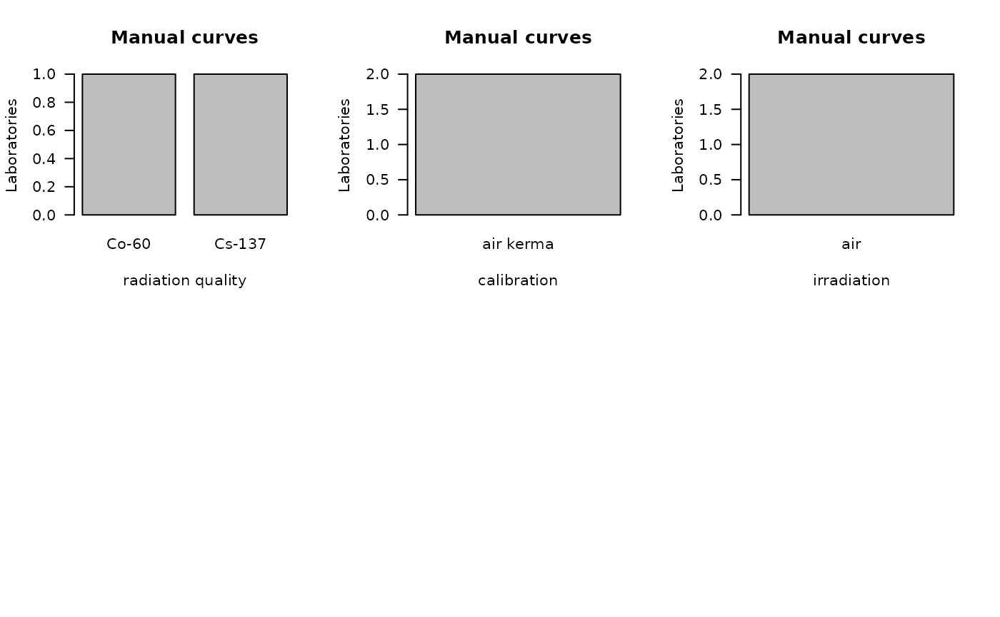

# Interlaboratory comparison

## Load estimation results

The first step is to select how many laboratories are going to
participate in the comparison and upload their corresponding Estimation
results file. Those files must be in `.rds` format obtained in the dose
estimation module in Biodose Tools. Clicking on “Dose estimation
summary” will load the files into the app and display the contained
information on the “Results” tabbed box in four different tables: (1)
Data summary, with total number of cells ($N$), total number of
aberrations ($X$), mean ($\bar{y}$), standard error ($\sigma$),
dispersion index ($\sigma^{2}/\bar{y}$), and $u$-value, as well as the
dose estimation with the upper and lower limits, the ($Sample$) name
identifying each case with their corresponding ID, the ($Module$), the
($Lab$) and the ($Type$) of method used for the scoring of the curve
used for the estimation. (2) Curves, with the ($Module$), the ($Lab$)
and the ($Type$) as well as the used curve coefficients, standard errors
($\sigma$) and several irradiation conditions. Tables (3) and (4) will
display for each Lab ans Sample the dose estimation for “Dose” and the
Frequencies for “Frequencies”.


‘Data Input’ box and ‘Results’ tabbed box in the interlaboratory
comparison module when loading curves from an `.rds` file for two
laboratories.

This step is accomplished in R by loading an existing `.rds` object via
[`readRDS()`](https://rdrr.io/r/base/readRDS.html):

``` r
fit_results_A1 <- system.file("extdata", "A1_Estimation_results.rds", package = "biodosetools") %>%
  readRDS()

fit_results_A2 <- system.file("extdata", "A2_Estimation_results.rds", package = "biodosetools") %>%
  readRDS()
```

And then calling ’summary_curve_tables()\`:

``` r
list_lab_names <- list("A1", "A2")
all_rds <- list(fit_results_A1, fit_results_A2)

tables_list <- summary_curve_tables(
  num_labs = 2,
  list_lab_names, 
  all_rds
)
```

## Plot data input

Clicking on “Plot summary” will display four different plots in the
“Plots summary” Results tabbox.

This step is accomplished in R by calling:
[`yield_boxplot()`](../reference/yield_boxplot.md),
[`dose_boxplot()`](../reference/dose_boxplot.md),
[`u_test_plot()`](../reference/u_test_plot.md) and
[`DI_plot()`](../reference/DI_plot.md) functions:

``` r
yield_boxplot(
  dat =  tables_list[[1]],
  place = "UI"
)
```



``` r

dose_boxplot(
  dat = tables_list[[1]],
  place = "UI"
)
```



``` r

u_test_plot(
  dat = tables_list[[1]],
  place = "UI"
)
```



``` r

DI_plot(
  dat = tables_list[[1]],
  place = "UI"
)
```

 Clicking on “Plot
curves” on the Curve section on the Results tabbox will display four
different plots in the “Plots curves” Results tabbox.In this example all
curves were manually scored, therefore there are only two plots.

This step is accomplished in R by calling:
[`curves_plot()`](../reference/curves_plot.md)and
[`bar_plots()`](../reference/bar_plots.md) functions:

``` r
curves_plot(
  dat = tables_list[[2]], 
  curve = "manual", 
  curve_type = "lin_quad",
  place = "UI"
)
```



``` r

bar_plots(
  dat = tables_list[[2]], 
  curve = "manual",
  place = "UI"
)
```

 \## Performe Z-score

The final step is to select the Input type between “Dose” or
“Frequency”, the algorithm among “AlgA”, “AlgB and”QHampel” and provide
the reference value for each sample (only when Dose input is selected).


‘Z-score Data input options’ in the interlaboratory comparison module.

Clicking “Calculate and plot” will display the results table:


‘Z-score Results table’ in the interlaboratory comparison module.

To calculate the Z-Score in R we can call
[`calc.zValue.new()`](../reference/calc.zValue.new.md):

``` r

zscore_S1 <- calc.zValue.new(
  X =  tables_list[[1]][["estimate"]][1:2],
  type = "dose", 
  alg = "algA", 
  c = 2.56
)

zscore_S2 <- calc.zValue.new(
  X =  tables_list[[1]][["estimate"]][3:4],
  type = "dose", 
  alg = "algA", 
  c = 3.41
)

zscore_S3 <- calc.zValue.new(
  X =  tables_list[[1]][["estimate"]][5:6],
  type = "dose", 
  alg = "algA", 
  c = 4.54
)
```

We can generate the plots in R by calling:
[`plot_zscore_all()`](../reference/plot_zscore_all.md),
`plot_deviation_all`,
[`plot_interlab_v2()`](../reference/plot_interlab_v2.md),
[`plot_interlab_deviation()`](../reference/plot_interlab_deviation.md)
and [`plot_triage_interlab()`](../reference/plot_triage_interlab.md)
functions:

``` r

data_frame_zscore <- data.frame(
          Lab = tables_list[[1]][["Lab"]],
          Sample = tables_list[[1]][["Sample"]],
          Type = tables_list[[1]][["Type"]],
          Reference = c(2.56, 3.41, 4.54),
          Dose = tables_list[[1]][["estimate"]],
          Deviation = tables_list[[1]][["estimate"]] - c(2.56, 3.41, 4.54),
          Zscore = c(zscore_S1, zscore_S2, zscore_S3),
          stringsAsFactors = FALSE
        )

plot_1 <- plot_zscore_all(
  zscore = data_frame_zscore, 
  select_method = "algA",
  place = "UI"
)

plot_2 <- plot_deviation_all(
  zscore = data_frame_zscore, 
  select_method = "algA",
  place = "UI"
)

plot_3 <- plot_interlab_v2(
  zscore = data_frame_zscore, 
  select_method = "algA", 
  sum_table = tables_list[[1]],
  place = "UI"
)


plot_4 <- plot_interlab_deviation(
  zscore = data_frame_zscore, 
  sum_table = tables_list[[1]],
  place = "UI"
)


line_triage <- list(`1` = 2.56, `2` = 3.41, `3` = 4.54)

plot_5 <- plot_triage_interlab(
  line_triage,
  sum_table = tables_list[[1]],
  place = "UI"
)
```

[`plot_interlab_v2()`](../reference/plot_interlab_v2.md),
[`plot_interlab_deviation()`](../reference/plot_interlab_deviation.md)
and [`plot_triage_interlab()`](../reference/plot_triage_interlab.md)
functions generate a list of plots (1 for each sample).

``` r

plot_1
```


Plots generated by {biodosetools}.

``` r
plot_2
```


Plots generated by {biodosetools}.

``` r
for (p in plot_3) print(p)
```


Plots generated by {biodosetools}.


Plots generated by {biodosetools}.


Plots generated by {biodosetools}.

``` r
for (p in plot_4) print(p)
```


Plots generated by {biodosetools}.


Plots generated by {biodosetools}.


Plots generated by {biodosetools}.

``` r
for (p in plot_5) print(p)
```


Plots generated by {biodosetools}.


Plots generated by {biodosetools}.


Plots generated by {biodosetools}.
