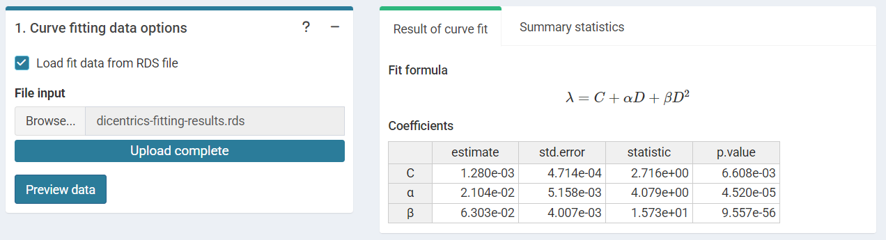
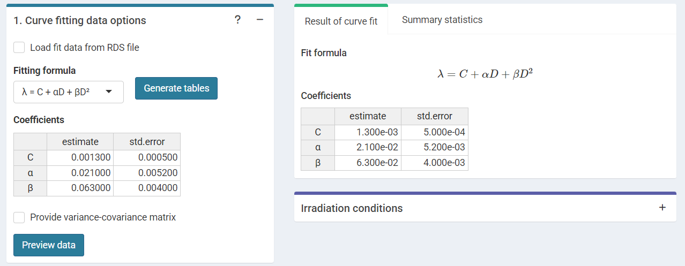
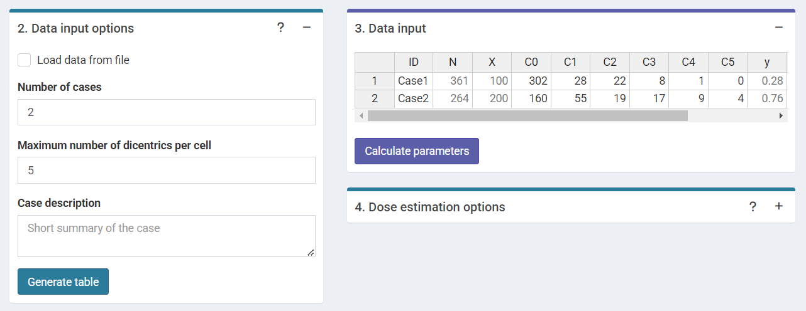
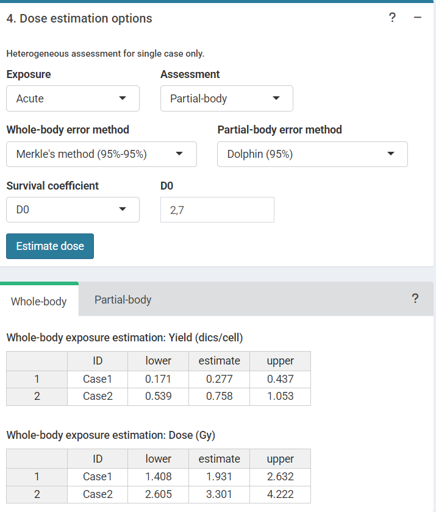
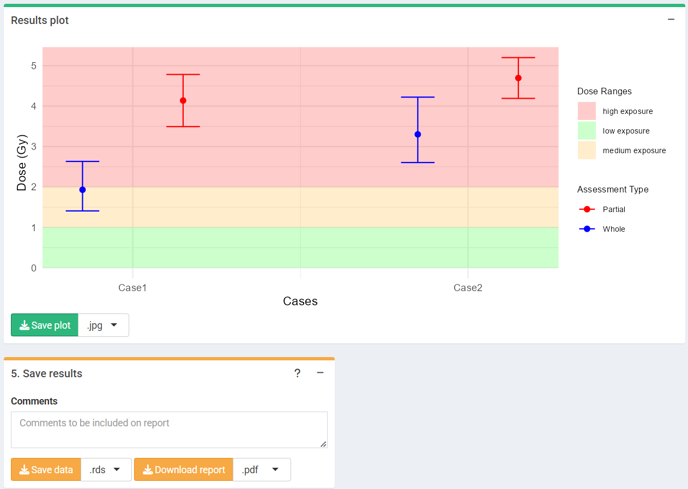

```{r, include = FALSE}
library(biodosetools)
knitr::opts_chunk$set(
  fig.dpi = 96,
  collapse = TRUE,
  comment = "#>"
)
```

## Load pre-calculated curve

The first step is to either load the pre-calculated curve in `.rds` format obtained in the dose-effect fitting module or input the curve coefficients manually in case the user wants to use a pre-existing curve calculated outside of Biodose Tools. Clicking on "Preview data" will load the curve into the app and display it on the "Results" tabbed box.

```{r sc-dic-estimate-01, echo=FALSE, out.width='100%', fig.align='center', fig.cap="'Curve fitting data options' box and 'Results' tabbed box in the dose estimation module when loading curve from an `.rds` file."}

```

```{r sc-dic-estimate-01b, echo=FALSE, out.width='100%', fig.cap="'Curve fitting data options' box and 'Results' tabbed box in the dose estimation module when inputting curve coefficients manually. Note that if no variance-covariance matrix is provided, only the variances calculated from the coefficients' standard errors will be used in calculations."}

```

This step is accomplished in R by either using the results from `fit()` or by loading an existing `.rds` object via `readRDS()`:

```{r load-fitting-results, tidy=TRUE, tidy.opts=list(width.cutoff=60)}
fit_results <- system.file("extdata", "dicentrics-fitting-results.rds", package = "biodosetools") %>%
  readRDS()
```

```{r fit-results}
fit_results$fit_coeffs
```

## Input case data

Next we can choose to either load the case data from a file (supported formats are `.csv`, `.dat`, and `.txt`) or to input the data manually. Once the table is generated and filled, the "Calculate parameters" button will calculate the total number of cells ($N$), total number of aberrations ($X$), as well as mean ($\bar{y}$), standard error ($\sigma$), dispersion index ($\sigma^{2}/\bar{y}$), and $u$-value.

```{r sc-dic-estimate-02, echo=FALSE, out.width='100%', fig.align='center', fig.cap="'Data input options' and 'Data input' boxes in the dose estimation module."}

```

This step is accomplished in R by calling the `calculate_aberr_table()` function:

```{r dic-case-data}
case_data <- system.file("extdata", "cases-data-partial.csv", package = "biodosetools") %>%
  utils::read.csv(header = TRUE) %>%
  calculate_aberr_table(
    type = "case",
    assessment_u = 1,
    aberr_module = "dicentrics"
  )
```

```{r}
case_data
```

## Perform dose estimation

The final step is to select the dose estimation options. In the "Dose estimation options" box we can select type of exposure (acute, protracted, and highly protracted), type of assessment (whole-body, partial-body, or heterogeneous), and error methods for each type of assessment.

```{r sc-dic-estimate-03, echo=FALSE, out.width='60%', fig.align='center', fig.cap="'Dose estimation options' box in the dose estimation module."}

```

```{r sc-dic-estimate-04, echo=FALSE, out.width='100%', fig.align='center', fig.cap="'Results' tabbed box, 'Curve plot' and 'Save results' boxes in the dose estimation module."}

```

To perform the dose estimation in R we can call the adequate `estimate_*()` functions. In this example, we will use `estimate_whole_body_merkle()` and `estimate_partial_body_dolphin()`. First of all, however, we will need to load the fit coefficients and variance-covariance matrix:

```{r dic-parse-fit-results}
fit_coeffs <- fit_results[["fit_coeffs"]]
fit_var_cov_mat <- fit_results[["fit_var_cov_mat"]]
```

After that is done, we can simply call `estimate_whole_body_merkle()` and `estimate_partial_body_dolphin()`:

```{r dic-dose-estimation-whole}
results_whole_merkle <- estimate_whole_body_merkle(
  case_data,
  fit_coeffs,
  fit_var_cov_mat,
  conf_int_yield = 0.83,
  conf_int_curve = 0.83,
  protracted_g_value = 1,
  aberr_module = "dicentrics"
)
```

```{r dic-dose-estimation-partial}
results_partial <- estimate_partial_body_dolphin(
  case_data,
  fit_coeffs,
  fit_var_cov_mat,
  conf_int = 0.95,
  gamma = 1 / 2.7,
  aberr_module = "dicentrics"
)
```

To visualise the estimated doses, we call the `plot_estimated_dose_curve()` function:

```{r dic-estimated-dose-curve, fig.width=6, fig.height=3.5, fig.align='center', fig.cap="Plot of estimated doses generated by \\{biodosetools\\}. The grey shading indicates the uncertainties associated with the calibration curve."}
plot_estimated_dose_curve(
  est_doses = list(
    whole = results_whole_merkle,
    partial = results_partial
  ),
  fit_coeffs,
  fit_var_cov_mat,
  protracted_g_value = 1,
  conf_int_curve = 0.95,
  aberr_name = "Dicentrics"
)
```
