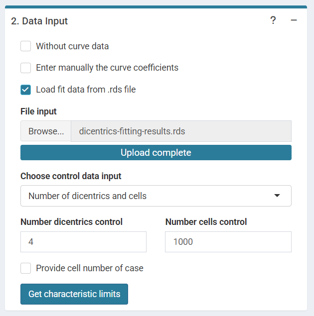

```{r, include = FALSE}
library(biodosetools)
knitr::opts_chunk$set(
  fig.dpi = 96,
  collapse = TRUE,
  comment = "#>"
)
```

## Compare proband vs. control

The first step is to input the number of dicentrics and the number of cells counted for the proband (case) and for the control. A significant P-value suggests that the proband was exposed two a dose  ($D>0Gy$) and the calculation of the dose shall be performed if an appropriate calibration curve is available. 

```{r sc-dic-limits-01, echo=FALSE, out.width='100%', fig.align='center', fig.cap="'Data input options' in the characteristic limits module - Compare proband vs control method."}

```

This step is accomplished in R by `poisson.test()` function:

```{r dic-limits-results-01, tidy=TRUE, tidy.opts=list(width.cutoff=60)}
control_data <- c(aberr = 1,
                  cells = 1000)

proband_data <- c(aberr = 13,
                  cells = 1000)
        

result_data <- matrix(c(
    control_data["aberr"] / control_data["cells"],
    proband_data["aberr"] / proband_data["cells"],
    stats::poisson.test(c(proband_data["aberr"], control_data["aberr"]),
                        c(proband_data["cells"], control_data["cells"]))$p.value
      ), ncol = 3, nrow = 1)
    
    colnames(result_data) <- c("dics/cell (control)", "dics/cell (case)", "P-value")
```

```{r}
result_data
```

## Characteristic limits

The user can choose the type I error rate($α$)(false positive rate) and the type II error rate ($β$) (false negative rate).

```{r sc-dic-limits-02, echo=FALSE, out.width='100%', fig.align='center', fig.cap="'Data input options' in the characteristic limits module - Characteristic limits."}
knitr::include_graphics("figures/screenshot-dicentrics-limits-02.png")
```

The input data are: the number of dicentrics and cells of the control data if ($Number of dics and cells$) is selected or the mean number of dicentrics per cell if ($Dics per cell$) is selected. 
Input the pre-calculated curve in `.rds` format obtained in the dose-effect fitting module. 

```{r sc-dic-limits-03, echo=FALSE, out.width='100%', fig.align='center', fig.cap="'Data input options' in the characteristic limits module - Characteristic limits - Without curve data option."}

```

or input the curve coefficients manually in case the user wants to use a pre-existing curve calculated outside of Biodose Tools. 

```{r sc-dic-limits-04, echo=FALSE, out.width='100%', fig.align='center', fig.cap="'Data input options' in the characteristic limits module - Characteristic limits - Loaded data .rds option."}

```
If these information is not available, choose ($Without curve data$) and the dose will not be calculated.

```{r sc-dic-limits-05, echo=FALSE, out.width='100%', fig.align='center', fig.cap="'Data input options' in the characteristic limits module - Characteristic limits - Manually entered curve data option."}

```

This step is accomplished in R by calling the `calculate_characteristic_limits()` function that gives the decision threshold and the detection limit:

```{r dic-limits-results-02}
cells_proband <- c(20, 50, 100, 200, 500, 1000)
control_data <- c(aberr = 4,
                  cells = 1000)

c_limits <- sapply(cells_proband, function(x) calculate_characteristic_limits(
  y0 = control_data["aberr"],
  n0 = control_data["cells"],
  n1 = x,
  alpha = 0.05, 
  beta = 0.1, 
  ymax = 100, 
  type = "var"
  ))
  
```

```{r}
c_limits
```
For the Minimum resolvable dose ($(Gy)$) and the Dose at detection limit ($(Gy)$) `project_yield()` function is applied:
```{r dic-limits-results-03}
fit_results_list <- system.file("extdata", "dicentrics-fitting-results.rds", package = "biodosetools")%>%
  readRDS()
fit_coeffs <- fit_results_list$fit_coeffs[, "estimate"]

 est_dec <- sapply((unlist(c_limits["decision_threshold", ]) + 1) / cells_proband, function(x) project_yield(
   yield = x,
   type = "estimate",
   general_fit_coeffs = fit_coeffs,
   general_fit_var_cov_mat = NULL,
   protracted_g_value = 1,
   conf_int = 0))
  
 est_det <- sapply(unlist(c_limits["detection_limit", ]) / cells_proband, function(x) project_yield(
   yield = x,
   type = "estimate",
   general_fit_coeffs = fit_coeffs,
   general_fit_var_cov_mat = NULL,
   protracted_g_value = 1,
   conf_int = 0))                
```

```{r}
est_dec
est_det
```
Results are displayed in the UI as a table and can be saved in .csv and .tex

```{r sc-dic-limits-07, echo=FALSE, out.width='100%', fig.align='center', fig.cap="'Results' tabbed box in the characteristic limits module - Characteristic limits."}
knitr::include_graphics("figures/screenshot-dicentrics-limits-06.png")
```
