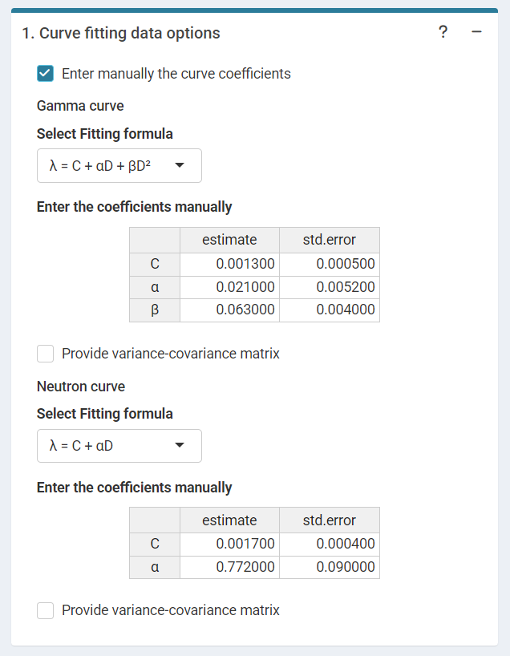
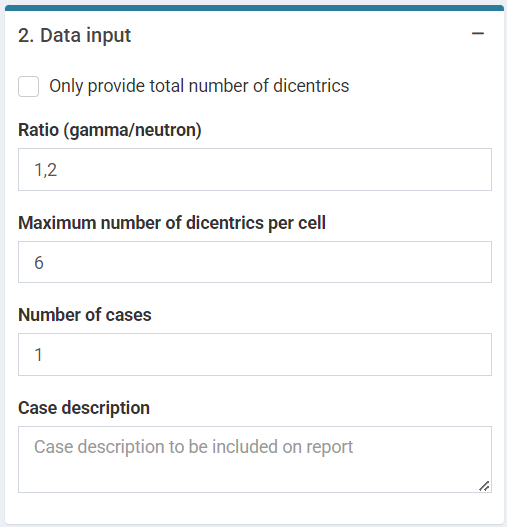

```{r, include = FALSE}
Sys.setenv(R_USER_LIBS = tempdir())  #Just in case for CRAN
library(biodosetools)
knitr::opts_chunk$set(
  fig.dpi = 96,
  collapse = TRUE,
  comment = "#>"
)
```

## Load pre-calculated curves

The first step is to either load the pre-calculated curves in `.rds` format obtained in the dose-effect fitting module: one for gamma rays and another for neutrons; or input the curves coefficients manually in case the user wants to use a pre-existing curve calculated outside of Biodose Tools. 

```{r sc-dic-mixed-01, echo=FALSE, out.width='100%', fig.align='center', fig.cap="'Curve fitting data options' and '.rds input curves' tabbed box in the dose estimation module for criticality accidents when loading curve from an `.rds` file."}
knitr::include_graphics("figures/screenshot-dicentrics-mixed-01.png")
```

```{r sc-dic-mixed-01b, echo=FALSE, out.width='100%', fig.cap="'Curve fitting data options'  in the dose estimation module for criticality accidents when inputting curve coefficients manually. Note that if no variance-covariance matrix is provided, only the variances calculated from the coefficients' standard errors will be used in calculations."}

```

The RDS file from the fitting module is needed to obtain the data when using R (or, alternatively, manual data frames that match the structure of the RDS):

```{r load-fitting-results-mixed, tidy=TRUE, tidy.opts=list(width.cutoff=60)}

fit_results_gamma <- system.file("extdata", "gamma_dicentrics-fitting-results.rds", package = "biodosetools") %>%
  readRDS()

fit_results_neutrons <- system.file("extdata", "neutrons-mixed-dicentrics-fitting-results.rds", package = "biodosetools") %>%
  readRDS()
```

```{r fit-results-mixed}
fit_results_gamma$fit_coeffs

fit_results_neutrons$fit_coeffs
```

## Input case data

Next we can write a case description in the corresponding box. Then, some parameters must be reported in order to perform the calculations: "Ratio (gamma/neutron)", "Maximum number of dics per cell", "Number of cases" and the dicentric distribution (3.Data input). The dicentric distribution table will automatically provide with total number of cells ($N$), total number of aberrations ($X$), as well as mean ($\bar{y}$), standard error ($\sigma$), dispersion index ($\sigma^{2}/\bar{y}$), and $u$-value. An ID column will also appear to identify each case. Multiple cases are supported. Finally, the "Estimate dose" button will give the results.

```{r sc-dic-mixed-02, echo=FALSE, out.width='100%', fig.align='center', fig.cap="'Data input' box in the dose estimation module for criticality accidents."}


```

## Perform dose estimation
Results will appear in green "Results tabs".

```{r sc-dic-mixed-03, echo=FALSE, out.width='60%', fig.align='center', fig.cap="'Results' tabbed box, 'Curve plot' and 'Save results' boxes in the dose estimation module for criticality accidents."}
knitr::include_graphics("figures/screenshot-dicentrics-mixed-03a.png")

```

To perform the dose estimation in R we can call `fun.estimate.criticality()`. First of all, however, we will need to load the fit coefficients and variance-covariance matrix:

```{r dic-parse-fit-results-mixed}

coef_gamma <- fit_results_gamma[["fit_coeffs"]][,1]
cov_gamma <- fit_results_gamma[["fit_var_cov_mat"]]
coef_neutron <- fit_results_neutrons[["fit_coeffs"]][,1]
cov_neutron <-  fit_results_neutrons[["fit_var_cov_mat"]]

```

After that is done, we can simply call `fun.estimate.criticality()`:

```{r dic-dose-estimation-mixed}
est_doses <- fun.estimate.criticality(
  num_cases = 1,
  dics = 380, 
  cells = 218, 
  coef_gamma, 
  cov_gamma, 
  coef_neutron, 
  cov_neutron, 
  ratio = 1.2, 
  p = 0)

```


```{r}
est_doses
```

To visualise the estimated doses, we call the `plot_estimated_dose_curve_mx()` function:

```{r dic-estimated-dose-curve-mixed, fig.width=6, fig.height=3.5, fig.align='center', fig.cap="Plot of estimated doses generated by \\{biodosetools\\ criticality accidents module}. The grey shading indicates the uncertainties associated with the calibration curve."}

plot_estimated_dose_curve_mx(
  name = "Sample1", 
  est_doses = est_doses[[1]], 
  fit_coeffs = coef_gamma, 
  fit_var_cov_mat = cov_gamma,
  curve_type = "gamma",
  protracted_g_value = 1,
  conf_int_curve = 0.95, 
  place = "UI")
  

plot_estimated_dose_curve_mx(
  name = "Sample1", 
  est_doses = est_doses[[1]], 
  fit_coeffs = coef_neutron, 
  fit_var_cov_mat = cov_neutron,
  curve_type = "neutron",
  protracted_g_value = 1,
  conf_int_curve = 0.95, 
  place = "UI")
```
