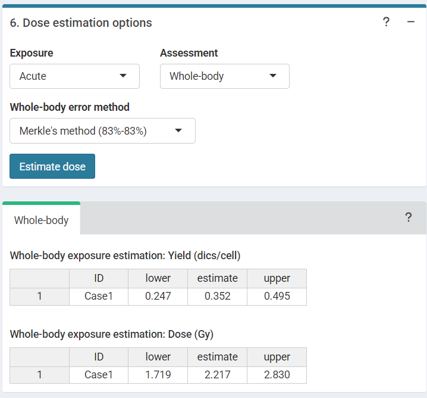

```{r, include = FALSE}
library(biodosetools)
knitr::opts_chunk$set(
  fig.dpi = 96,
  collapse = TRUE,
  comment = "#>"
)
```

### Load pre-calculated curve

The first step is to either load the pre-calculated curve in `.rds` format obtained in the dose-effect fitting module or to input the curve coefficients manually. Clicking on "Preview data" will load the curve into the app and display it on the "Results" tabbed box.

```{r sc-trans-estimate-01, echo=FALSE, out.width='100%', fig.align='center', fig.cap="'Curve fitting data options' box and 'Results' tabbed box in the dose estimation module"}
knitr::include_graphics("figures/screenshot-translocations-estimate-01.png")
```

This step is accomplished in R by either using the results from `fit()` or by loading an existing `.rds` object via `readRDS()`:

```{r load-fitting-results, tidy=TRUE, tidy.opts=list(width.cutoff=60)}
fit_results <- system.file("extdata", "translocations-fitting-results.rds", package = "biodosetools") %>%
  readRDS()
```

```{r fit-results}
fit_results$fit_coeffs
```

To be able to fit the equivalent full genome case data, we need to calculate the genomic conversion factor.

To do this, in the "Stain color options" box we select the sex of the individual, and the list of chromosomes and stains used for the translocation assay. Clicking on "Generate table" will show a table in the "Chromosome data" box in which we select the chromosome-stain pairs. Clicking on the "Calculate fraction" will calculate the genomic conversion factor.

```{r sc-trans-estimate-02, echo=FALSE, out.width='100%', fig.align='center', fig.cap="'Stains color options', 'Chromosome data' and 'Genomic conversion factor' boxes in the dose estimation module"}
knitr::include_graphics("figures/screenshot-translocations-estimate-02.png")
```

To calculate the genomic conversion factor in R we call the `calculate_genome_factor()` function:

```{r trans-genome-factor-est}
genome_factor <- calculate_genome_factor(
  dna_table = dna_content_fractions_morton,
  chromosome = c(1, 2, 3, 4, 5, 6),
  color = c("Red", "Red", "Green", "Red", "Green", "Green"),
  sex = "male"
)
```

```{r}
genome_factor
```

Next we can choose to either load the case data from a file (supported formats are `.csv`, `.dat`, and `.txt`) or to input the data manually. If needed, the user can select to use confounders (either using Sigurdson's method, or by inputting the translocation frequency per cell). Once the table is generated and filled, the "Calculate parameters" button will calculate the number of cells ($N$), number of aberrations ($X$), as well as mean ($\bar{F}_{p}$), error ($\hat{\sigma}_{p}$), dispersion index ($\hat{\sigma}^{2}/\bar{y}$), $u$-value, expected translocation rate ($X_{c}$), full genome mean ($\bar{F}_{g}$), and full genome error ($\hat{\sigma}_{g}$).

```{r sc-trans-estimate-03, echo=FALSE, out.width='100%', fig.align='center', fig.cap="'Data input options' and 'Data input' boxes in the dose estimation module"}

```

This step is accomplished in R by calling the `calculate_aberr_table()` function:

```{r trans-case-data}
case_data <- data.frame(
  C0 = 288, C1 = 52, C2 = 9, C3 = 1
) %>%
  calculate_aberr_table(
    type = "case",
    assessment_u = 1
  ) %>%
  dplyr::rename(Fp = mean, Fp_err = std_err) %>%
  dplyr::mutate(
    Xc = calculate_trans_rate_sigurdson(
      cells = N,
      genome_factor = genome_factor,
      age_value = 30,
      smoker_bool = TRUE
    ),
    Fg = (X - Xc) / (N * genome_factor),
    Fg_err = Fp_err / sqrt(genome_factor)
  )
```

```{r}
case_data
```

### Perform dose estimation

The final step is to select the dose estimation options. In the "Dose estimation options" box we can select type of exposure (acute or protracted), type of assessment (whole-body or partial-body), and error methods for each type of assessment.

```{r sc-trans-estimate-04, echo=FALSE, out.width='60%', fig.align='center', fig.cap="'Dose estimation options' box in the dose estimation module"}

```

```{r sc-trans-estimate-05, echo=FALSE, out.width='100%', fig.align='center', fig.cap="'Results' tabbed box, 'Curve plot' and 'Save results' boxes in the dose estimation module"}
knitr::include_graphics("figures/screenshot-translocations-estimate-05.png")
```

To perform the dose estimation in R we can call the adequate `estimate_*()` functions. In this example, we will use `estimate_whole_body_delta()`. First of all, however, we will need to load the fit coefficients and variance-covariance matrix:

```{r trans-parse-fit-results}
fit_coeffs <- fit_results[["fit_coeffs"]]
fit_var_cov_mat <- fit_results[["fit_var_cov_mat"]]
```

Since we have a protracted exposure, we need to calculate the value of $G(x)$:

```{r trans-protracted-g-value}
protracted_g_value <- protracted_g_function(
  time = 0.5,
  time_0 = 2
)
```

```{r}
protracted_g_value
```

```{r trans-dose-estimation-whole-delta}
results_whole_delta <- estimate_whole_body_delta(
  case_data,
  fit_coeffs,
  fit_var_cov_mat,
  conf_int = 0.95,
  protracted_g_value,
  aberr_module = "translocations"
)
```

To visualise the estimated doses, we call the `plot_estimated_dose_curve()` function:

```{r trans-estimated-dose-curve, fig.width=6, fig.height=3.5, fig.align='center'}
plot_estimated_dose_curve(
  est_doses = list(whole = results_whole_delta),
  fit_coeffs,
  fit_var_cov_mat,
  protracted_g_value,
  conf_int_curve = 0.95,
  aberr_name = "Translocations"
)
```
