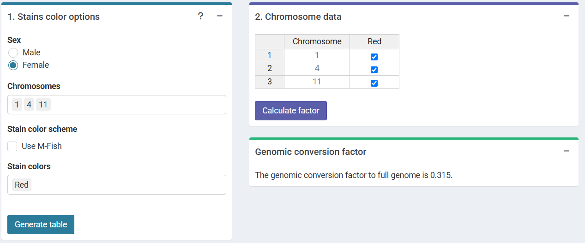

```{r, include = FALSE}
library(biodosetools)
knitr::opts_chunk$set(
  fig.dpi = 96,
  collapse = TRUE,
  comment = "#>"
)
```

## Calculate genomic conversion factor

To be able to fit the equivalent full genome dose-effect curve, we need to calculate the genomic conversion factor.

To do this, in the "Stain color options" box we select the sex of the individual, and the list of chromosomes and stains used for the translocation assay. Clicking on "Generate table" will show a table in the "Chromosome data" box in which we select the chromosome-stain pairs. Clicking on the "Calculate fraction" will calculate the genomic conversion factor.

```{r sc-trans-fit-01, echo=FALSE, out.width='100%', fig.align='center', fig.cap="'Stains color options', 'Chromosome data' and 'Genomic conversion factor' boxes in the dose-effect fitting module."}

```

To calculate the genomic conversion factor in R we call the `calculate_genome_factor()` function:

```{r trans-genome-factpr-fit, tidy=FALSE}
genome_factor <- calculate_genome_factor(
  dna_table = dna_content_fractions_morton,
  chromosome = c(1, 4, 11),
  color = rep("Red", 3),
  sex = "female"
)
```

```{r}
genome_factor
```

## Input count data

Once the genomic conversion factor has been calculated, we can input the count data. On the {shiny} app, we can select to either load the count data from a file (supported formats are `.csv`, `.dat`, and `.txt`) or to input the data manually. Once the table is generated and filled, the "Calculate parameters" button will calculate the total number of cells ($N$), total number of aberrations ($X$), as well as mean ($\bar{y}$), variance ($\sigma^{2}$), dispersion index ($\sigma^{2}/\bar{y}$), and $u$-value.

```{r sc-trans-fit-02, echo=FALSE, out.width='100%', fig.align='center', fig.cap="'Data input options' and 'Fitting options' boxes in the dose-effect fitting module."}
knitr::include_graphics("figures/screenshot-translocations-fit-02.png")
```

```{r sc-trans-fit-03, echo=FALSE, out.width='75%', fig.align='center', fig.cap="'Data input' box in the dose-effect fitting module."}
knitr::include_graphics("figures/screenshot-translocations-fit-03.png")
```

This step is accomplished in R by calling the `calculate_aberr_table()` function:

```{r trans-count-data, tidy=TRUE, tidy.opts=list(width.cutoff=60)}
count_data <- system.file("extdata", "count-data-rodriguez-2004.csv", package = "biodosetools") %>%
  utils::read.csv() %>%
  calculate_aberr_table(type = "count") %>%
  dplyr::mutate(N = N * genome_factor)
```

```{r}
count_data
```

## Perform fitting

To perform the fitting the user needs to select the appropriate fitting options to click the "Calculate fitting" button on the "Data input" box. The fit can be done either using the full genome translocations, or those measured by FISH. This will not impact any future dose estimation, as the results internally use the full genome translocations.

The fitting results and summary statistics are shown in the "Results" tabbed box, and the dose-effect curve is displayed in the "Curve plot" box.

The "Export results" box shows two buttons: (a) "Save fitting data", and (b) "Download report". The "Save fitting data" will generate an `.rds` file that contains all information about the count data, irradiation conditions, and options selected when performing the fitting. This file can be then loaded in the dose estimation module to load the dose-effect curve coefficients.

Similarly, the "Download report" will generate a `.pdf` or a `.docx` report containing all inputs and fitting results.

```{r sc-trans-fit-04, echo=FALSE, out.width='100%', fig.align='center', fig.cap="'Results' tabbed box, 'Curve plot' and 'Export results' boxes in the dose-effect fitting module."}
knitr::include_graphics("figures/screenshot-translocations-fit-04.png")
```

To perform the fitting in R we call the `fit()` function:

```{r trans-fit-results}
fit_results <- fit(
  count_data = count_data,
  model_formula = "lin-quad",
  model_family = "automatic",
  fit_link = "identity",
  aberr_module = "translocations"
)
```

The `fit_results` object is a list that contains all necessary information about the count data as well as options selected when performing the fitting. This is a vital step to ensure traceability and reproducibility. Below we can see its elements:

```{r}
names(fit_results)
```

In particular, we can see how `fit_coeffs` matches the results obtained in the UI:

```{r trans-fit-coeffs-r}
fit_results$fit_coeffs
```

To visualise the dose-effect curve, we call the `plot_fit_dose_curve()` function:

```{r trans-fit-dose-curve, fig.width=6, fig.height=3.5, fig.align='center', fig.cap="Plot of dose-effect curve generated by \\{biodosetools\\}. The grey shading indicates the uncertainties associated with the calibration curve."}
plot_fit_dose_curve(
  fit_results,
  aberr_name = "Translocations"
)
```
